Falko, 27.08.2022

# Online Plattform for with Basic Functionality for Dictionary Editing

This document describes the steps necessary for switching to an online editing for the group of dictionary editors working on the DPD and related dictionaries.
The idea is to cover the minimal requirements necessary to enable an online editing of the data base in a manner that allows for a synchronized access by multiple editors to the same data, without introducing any disadvantages for the
editors. An outline of its features is listed in the subsequent section.

## Outline of the Features 

* Multiple editors can access the dictionary data concurrently.
* Each dictionary entry in the data base reflects the superset of the DPD and DPS ODT columns, so that both existing sets of data can merged and imported into the application.
* Multiple target languages are supported.
* Editors can assume two different roles:
  * Dictionary Editor: Full access to all entries
  * Language Editor: Access only to a subset of the target languages that are modelled in the respective dictionary
* The dictionary generation remains as it is currently: a local process invoked by the editor with the already exising tools. The only difference is that the input data now is exported from the web application's central DB.

## Current Local Workflow 

The following diagram shows the current purely local workflow for editing and dictionary generation.

## Online Editing Workflow 

The following diagrams show the workflows for the initial one-time data migration, online editing, CSV export from the web-application and local dictionary generation:

The following diagram shows the data base model for the dictionary data:

* Each dictionary has a number of entries (headwords)
* Each headword object features the superset of all the columns currently used in DPD and DPS
* Each headword can have any number of meanings in the dictionary's primary target language (i.e. here English)
* Each meaning can have translations in any secondary target language defined for this dictionary

```plantuml
@startuml
skinparam wrapWidth 650

hide circle 
entity "Dictionary" as dict {
<<col>> *dictionary_id (primary key)
--
<<col>> Dictionary name 
}

entity "Dictionary Entry (Headword)" as entry {
<<col>> *entry_id (primary key)
--
<<col>> <superset of all columns of DPD and DPS except for meanings>
<<col>> variant: Integer 

}
note right of entry: "variant" differentiates between various etymologically\ndifferent homonyms as e.g. PED does with superscript\nnumbers ("dhamma¹" etc). "variant" is automatically assigned\nby the application.

entity "Meaning" as meaning {
<<col>> *meaning_id (primary key)
--
<<col>> meaning_text: Text
}
note right of meaning: meaning is given in the primary target language\nof the dictionary


entity "Meaning_Translation" as meaning_translation {
<<col>> *meaning_id (primary key)
--
<<col>> meaning_text: Text
<<col>> target_language: Integer 
}
note right of meaning_translation: application logic ensures that only one meaning\ntranslation per target_language is possible

 dict ||..o{ entry
 entry ||..o{ meaning
 meaning ||..o{ meaning_translation 
@enduml
```
 

### Further Features of the Online Editing Workflow

* Access control: The following user rights and roles are supported:
  * Dictionary Owner: 
    * full access to all fields of the dictionary entries
    * invite other users to dictionary and assign right and role
  * Dictionary Editor: full
    * full access to all fields of the dictionary entries
  * Language Editor:
    * Online write access to meaning translations of a defined subset of target languages
* Prevention of concurrent access:
  * If two users modify the same entry concurrently, a corresponding message is shown to the second user attempting to submit his updates, allowing him to save his changes elsewhere manually and update the entry again. (other more
    sophisticated locking
    mechanisms are also conceivable for the future should that become necessary, e.g. timed locks in the database which would prevent this situation beforehand)
* Search form for dictionary entries
  * As a help for the translators, it is also possible to search for words where the a meaning given in primary target language has been more recently modified than one of its translations (indicating it might need an update).

## Comparison of the Current Workflow and the Described Workflow with Online Editing

### Advantages of the Online Workflow

* Online collaboration:
  * After the one-time merge procedure, the editors work an shared data which is always synchronized
  * It is easy to invite further collaborators for other target languages
  * Correctness of the web applications import and export features is easily verifiable: import and export of CSV must yield the same CSV again
* Support for multiple meanings for any headword.
  * This reflects the common approach of dictionaries. It is hard to achieve with a spreadsheet database as for each meaning one column has to be reserved.

### Disadvantages of the Online Workflow

* Offline editing is no longer possible. The impact of this should be considered thoroughly, as some editors may reside in southeast-asian countries, where power cut-offs and blackouts happen on a regular basis.[^1]

[^1]: In principle, it would also be possible to support offline editing. But the implementation of that would most likely require a multiple of the effort that is needed for the basic online editing functionality that is described in this
document. This would be a fragile process needing a lot of attendance; for instance the case where the cloud instance has already been updated and the user tries to import data in an old format.
